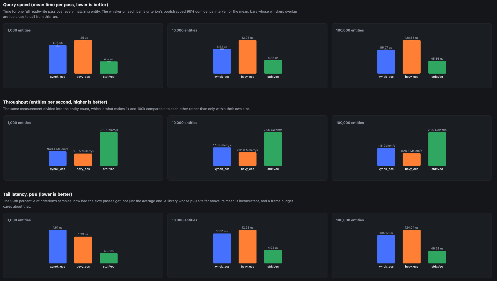
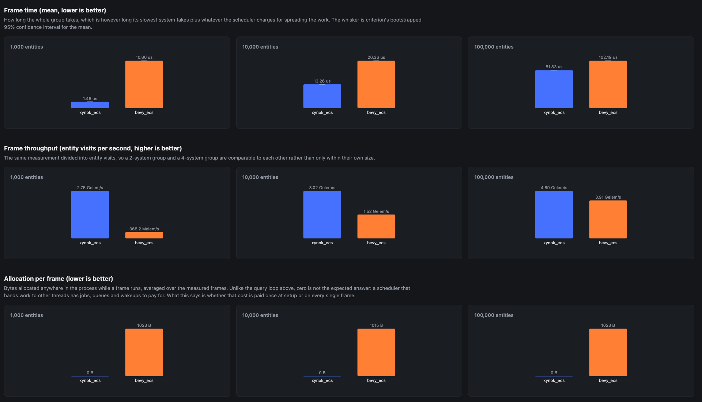

# xynok_ecs
[](https://discord.gg/a2qzfrFzWT)

## Introduction

This repository contains a lightweight ECS library designed specifically for the Xynok engine. My goal is not to build a feature-rich, general-purpose ECS, but rather to provide a lean implementation that covers the essential requirements for my engine's architecture.

## Core Functionality

The library focuses on providing the fundamental building blocks necessary for entity and component management. Currently, it supports:

- Entity initialization
- Component addition and removal
- Manual system scheduling

Notably, this library lacks complex abstractions such as job graphs or automatic parallelization. All operations must be scheduled manually by the developer.

## Performance and Benchmarks

I have included a benchmark comparison against [Bevy](https://github.com/bevyengine/bevy), but I want to be clear about what these numbers represent. While the current benchmarks show this library outperforming Bevy in certain scenarios, this is a result of its simplicity rather than superior architectural optimization. 

Because this library implements a significantly smaller feature set compared to Bevy, it naturally incurs less overhead. It is not "faster" in the sense of being a more efficient implementation of equivalent features.


| Single Thread | Multi-threaded |
| -------------- | --------------- |
|  |  |


## Current Limitations

This project is still in its early stages. Please keep the following in mind:

- The library has not been tested across a wide variety of hardware configurations.
- Testing & benchmarks has been confined to basic use cases.
- It has not yet been subjected to complex, real-world stress tests.


## Install
```toml
[dependencies]
xynok_ecs = { git = "https://github.com/Xynok-Engine/xynok_ecs.git", tag = "v0.1.29" }
```
## Concepts
To understand how the entire codebase works, you can check out these [videos](https://www.youtube.com/@xynok_youtube/playlists). I created them when I first started this repo. They explain the core concepts and the most important ideas that the codebase implements. I might update them in the future, but for now, they are a close match to the current state of the code.

## Examples
You can find all the examples in the [examples directory](./examples). To run an example:
**Cmd:** 
```bash
cargo run --example <name_of_rust_file_in_examples_folder>
```
**Example:** This command runs the file `examples/archetype.rs`.
```bash
cargo run --example archetype
```

## Benchmarks

**Cmd:**
```bash
./benches/scripts/bench.sh                              # both benches, then the report
./benches/scripts/bench.sh 1k                           # the same, only ids containing "1k"
cargo bench -p xynok_ecs_benches --bench query          # single-threaded timings
cargo bench -p xynok_ecs_benches --bench parallel       # multi-threaded timings
cargo run --release -p xynok_ecs_benches --bin report   # memory + report, from the timings above
```

`benches/` is a separate crate (`xynok_ecs_benches`) comparing single-threaded query iteration
against `bevy_ecs` and a plain `std::Vec` baseline, across every combination of query arity
(1, 2 or 3 components), archetype layout (1 archetype or 5) and entity count (1k, 10k, 100k).

Timing is done by [criterion](https://github.com/criterion-rs/criterion.rs), which picks the
iteration counts, runs the warm-up, collects the samples, bootstraps the confidence intervals,
classifies outliers and compares each run against the previous one on disk. Memory is a different
question and a stopwatch is the wrong instrument for it, so a second binary measures that through
a counting global allocator over the same workload:

- **footprint**: bytes still held once the storage is built, and what that works out to per entity
- **setup allocation**: every byte requested while building, and how many allocator calls it took
- **query-loop allocation**: bytes allocated inside the pass criterion times (must be 0, otherwise
  the timing is not iteration-only)
- **leak**: live bytes still held after the storage is dropped (must be 0)

The report binary joins the two and writes `benches/output/results.json` plus
`benches/output/report.html`, a self-contained page with the comparison table and charts. It exits
non-zero if any scenario allocates in the timed loop or leaks, so it works as a CI check too.
Criterion's own report lands at `target/criterion/report/index.html`.

### Multi-threaded scheduling
A second target, `benches/parallel.rs`, compares the two schedulers rather than the two query
loops. One benchmark is one frame: a group of systems that provably never touch the same component,
handed to `xynok_ecs`'s `add_system_parallel` on one side and to bevy's multi-threaded executor on
the other. Both pools run 4 worker threads, group sizes are 2 and 4 systems, and the entity counts
are the same 1k/10k/100k. The `std::Vec` baseline sits this one out, having no scheduler to compare.

It gets its own half of the report, with one difference in what is measured. A frame runs on
several threads at once, so its allocation figure comes from process-wide counters rather than
per-thread ones, and unlike the query loop it is not expected to be zero: a scheduler that hands
work to other threads has jobs, queues and wakeups to pay for. What the report shows is the
per-frame figure, which is the difference between paying that cost once and paying it every frame.
Those rows are reported but never fail the run.

