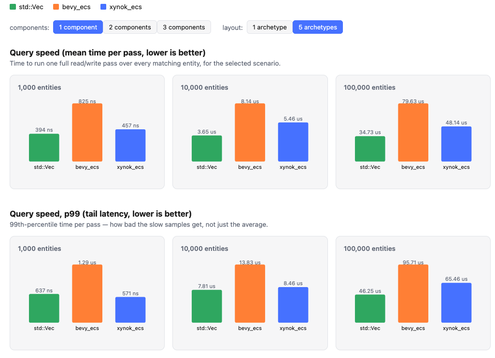

# xynok_ecs
[](https://discord.gg/a2qzfrFzWT)
## Current Benchmark(v0.1.0)


## Features
| status | feature | description or note |
| --------------- | --------------- | --------------- |
| ✅ | register archetype | register an archetype without spawning any data |
| ✅ | create/destroy | create and destroy entities and their associated data |
| ✅ | add/remove/merge component | add, remove, and merge components for an entity. Merging will override existing components. |
| ✅ | tuple archetype | clients can create an archetype with varying numbers of components. Currently, the maximum is 16 components per archetype. |
| ✅ | query | an iterator for querying components from an archetype |
| canceled | Shared - Archetype Component | [This is the reason](https://youtu.be/k_RyU6QKQ-A) |
| ✅ | system & scheduler | a session is a list of steps, run in the order they were added. [issue_link](https://github.com/Xynok-Engine/xynok_ecs/issues/3)|
| ✅ | parallel system group | `add_system_parallel((a, b, c))` runs a group at the same time on the lane A pool. You declare the group; the scheduler checks every pair's access scope at the call site rather than inferring a DAG. See [`examples/multi_thread_system.rs`](./examples/multi_thread_system.rs). |
| ✅ | parallel query | `Query::par_for_each_chunk` splits one system's work by chunk across the same pool. A chunk is already contiguous in memory, so each job gets a real slice. |
| ✅ | command buffer | create/destroy/add/remove from inside a parallel job. One buffer per worker, applied on a single thread in slot order at the end of each step. |
| todo | changed/added detection | the foundation for the observer pattern and architectures related to asset and resource pipelines (mesh, texture, sound, etc.) |
| canceled | persistent query | canceled: avoids the overhead of recreating every query whenever the structure changes. Currently, the query refresh process is spread across an entire frame. |
| todo | singleton |  |
| todo | Benchmark with flec | https://www.flecs.dev/flecs/md_docs_2Docs.html |
| todo | entity graph |  |
| Item1.2 | Item2.2 | Item3.2 |
| Item1.2 | Item2.2 | Item3.2 |


## Install
```toml
[dependencies]
xynok_ecs = { git = "https://github.com/Xynok-Engine/xynok_ecs.git", tag = "v0.1.15" }
```
## Concepts
To understand how the entire codebase works, you can check out these [videos](https://www.youtube.com/@xynok_youtube/playlists). I created them when I first started this repo. They explain the core concepts and the most important ideas that the codebase implements. I might update them in the future, but for now, they are a close match to the current state of the code.

## Examples
You can find all the examples in the [examples directory](./examples). To run an example:
**Cmd:** 
```bash
cargo run --example <name_of_rust_file_in_examples_folder>
```
**Example:** This command runs the file `examples/archetype.rs`.
```bash
cargo run --example archetype
```

## For Contributors

**step 1:** join the [discord](https://discord.gg/a2qzfrFzWT) server to get in touch with the maintainers.

**step 2:**: After that, you can track our progress on the [project board](https://github.com/orgs/Xynok-Engine/projects/1).
> [!IMPORTANT] 
> Only pick tasks that haven't been assigned yet.


### Tests
Storage-layout unit tests (chunk alignment, entity packing) live inline next to the code they
test in `src/` (`#[cfg(test)] mod test`), since they need private access that code outside the
crate can't have.

**Cmd:**
```bash
cargo test --lib
```

World-behavior tests (create/destroy, add/remove/merge component, drop glue, query, stress) are
integration tests under `tests/`, split by topic (`tests/create_destroy.rs`, `tests/chunk.rs`,
`tests/add_component.rs`, `tests/query.rs`, ...) with shared fixtures in `tests/common/mod.rs`.
They only use the crate's public API, plus a narrow read-only introspection module
(`xynok_ecs::world::testing`) gated behind the `test-util` Cargo feature, for checking storage
invariants the public API can't observe directly (row-swap mapping, chunk reuse, free-chunk
count). `Cargo.toml` already enables `test-util` for this crate's own `[dev-dependencies]`, so
no extra flags are needed to run them.

**Cmd:**
```bash
cargo test
```

### Benchmarks
`benches/` is a separate crate (`xynok_ecs_benches`) built on [criterion]. One shared workload
library defines the components, builds the storages and performs the passes; the targets on top of
it only measure. That way `xynok_ecs`, `bevy_ecs` and a plain `std::Vec` baseline are provably
running the same work, and the only thing that differs is the machinery underneath.

[criterion]: https://github.com/criterion-rs/criterion.rs

**Cmd:** (`cargo bench` always builds optimised, so there is no debug-build footgun here)
```bash
cargo bench -p xynok_ecs_benches
open target/criterion/report/index.html
```

#### `--bench query`, single-threaded iteration
One full pass over every matching entity, across 1/2/3 queried components, 1k/10k/100k entities,
and two archetype layouts: everything in one archetype, or the same entities split across five that
a query has to fan out over. All three competitors run back to back within each scenario, so a
machine that drifts in clock speed over a long run drags them all the same way instead of
penalising whichever one happened to be registered last.

#### `--bench parallel`, spreading one pass across threads
`xynok_ecs` (`Query::par_for_each_chunk` on a `xynok_concurrency` pool) against `bevy_ecs`
(`QueryState::par_iter_mut` on bevy's `ComputeTaskPool`), at 100k and 1M entities. Each library's
own single-threaded pass is measured alongside, because speedup against your own baseline is what a
parallel benchmark is actually asking, and only that ratio separates "spreads work well" from "was
faster to begin with".

`XYNOK_BENCH_THREADS` is the worker count, meaning the same thing to both: the calling thread runs
jobs alongside those workers either way, so `N` means `N + 1` threads doing work. It defaults to
`cores - 1`. One process measures one count, because bevy's `ComputeTaskPool` is a global that can
be sized exactly once, so the whole curve takes one run per count:

```bash
XYNOK_BENCH_THREADS=4 cargo bench -p xynok_ecs_benches --bench parallel
./benches/scripts/parallel_scaling.sh          # 1, 2, 4, 8 and cores-1
```

The thread count is part of every benchmark id, so those runs land next to each other in the report
instead of overwriting one another.

#### `--bin memory_report`, what the storages cost
Bytes are a different question from speed and a stopwatch is the wrong instrument, so they are
measured separately, through a counting global allocator over the same workload:

```bash
cargo run --release -p xynok_ecs_benches --bin memory_report
```

It reports the resident footprint per entity, how much was allocated to get there, and how many
allocator calls that took. It also re-runs the pass that `--bench query` times inside its own
measured region and fails if a single byte is allocated there, which is what makes those timings
iteration-only rather than iteration-plus-whatever-the-allocator-was-doing. A JSON copy lands in
`benches/output/memory.json`.

Leaks are not checked there. `tests/memory.rs` already does it against `World` directly, with an
allocator that counts chunk-sized allocations specifically.
